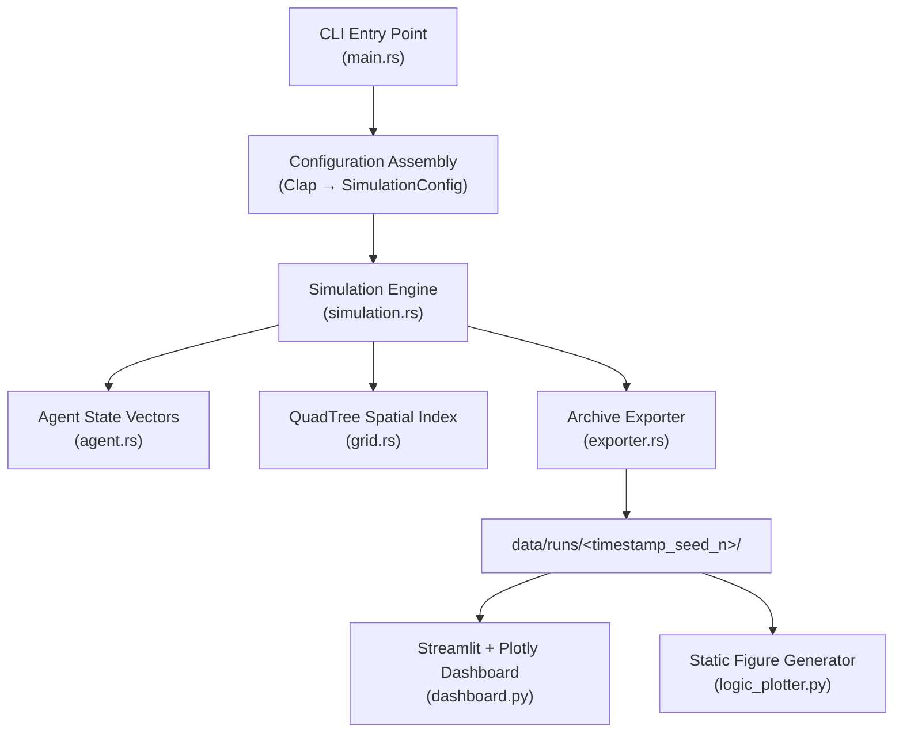
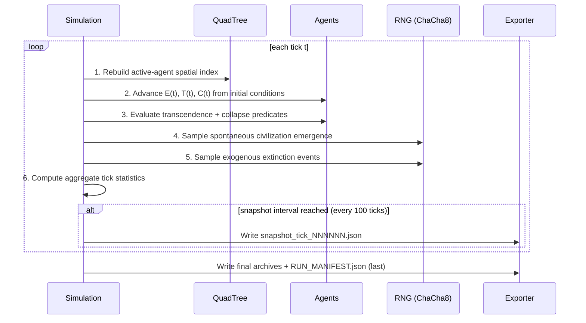
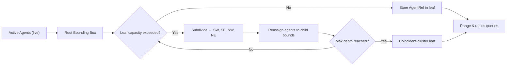

<div align="center">

# CAT Simulation Engine

**Cosmobiological Asynchrony Theory — an agent-based model of the Fermi paradox.**

[](LICENSE)
[](https://www.rust-lang.org/)
[](https://www.python.org/)

---

## Abstract

The CAT Simulation Engine is an agent-based modeling framework for the computational study of the Fermi paradox. It instantiates a falsifiable structural hypothesis — the *Asynchronous Gap* — in which technological capacity grows exponentially while the biological and institutional substrates required to govern it mature on a logarithmic timescale. Civilizations whose technological growth crosses an energetic threshold before their coordination index reaches a corresponding threshold satisfy the model's collapse predicate.

The engine is implemented as a Rust core (deterministic, parallelized over agents, numerically guarded) coupled to a Python analytics layer for inspection of completed runs. Each simulation produces an immutable archive of its state evolution, sufficient for replication and cross-run analysis.

The repository contains the engine, its test suite, the analytics layer, the theoretical and architectural documentation, and the metadata required for independent verification of any reported result.

</div>

---

## Table of Contents

1. [Theoretical Foundation](#1-theoretical-foundation)
2. [Empirical Findings](#2-empirical-findings)
3. [System Architecture](#3-system-architecture)
4. [Numerical Stability Doctrine](#4-numerical-stability)
5. [Repository Layout](#5-repository-layout)
6. [Quick Start](#6-quick-start)
7. [Reproducibility](#7-reproducibility)
8. [Analytics Layer](#8-analytics-layer)
9. [Validation and Continuous Integration](#9-validation-and-continuous-integration)
10. [Documentation Index](#10-documentation-index)
11. [Citation](#11-citation)
12. [License](#12-license)

---

## 1. Theoretical Foundation

CAT formalizes three constraints on the observability of technological life. Each is conceptually independent; their effects compound in expectation.

| Bound | Designation | Modeled? | Mathematical Form | Function in the Theory |
|:---:|:---|:---:|:---|:---|
| **I** | Chrono-Optical Horizon | No (geometric) | $d_{\text{obs}} \leq c \cdot \tau$ | Light-speed delay; observation is historical, not contemporary. |
| **II** | Asynchronous Gap | **Yes** | $E(t) = E_0 e^{rt}$, $T(t) = T_0 \max(0, 1 - \alpha \ln(1+t))$ | Exponential technology outruns logarithmic biological maturation. |
| **III** | Hive-Mind Anomaly | **Yes** | $C \geq C_{\text{hive}} = 0.85$ | High collectivism bypasses Bound II but suppresses expansion drive. |

### 1.1 The Collapse Predicate

A civilization terminates when three conditions hold simultaneously:

$$
\text{Collapse} \;\Longleftrightarrow\; \bigl(E > E_{\text{critical}}\bigr) \;\wedge\; \bigl(T > T_{\text{survival}}\bigr) \;\wedge\; \bigl(C < C_{\text{hive}}\bigr)
$$

Canonical thresholds: $E_{\text{critical}} = 2.5$, $T_{\text{survival}} = 0.6$, $C_{\text{hive}} = 0.85$. These are the calibration constants against which all reported empirical findings are computed; replications that change them must record the change in `simulation_config.json`.

### 1.2 The Transcendence Condition

A civilization bypasses Bound II — "transcends" in the engine's terminology — if its collectivism index $C$ crosses $C_{\text{hive}}$ before the collapse predicate triggers. The transcended state is durable but low-signature: the coordination that confers survival also attenuates the competitive pressure that would otherwise drive detectable interstellar expansion. The full conceptual treatment is given in [`docs/theory/PHILOSOPHY.md`](docs/theory/PHILOSOPHY.md).

---

## 2. Empirical Findings

The following figures constitute the canonical baseline of the engine. They are produced by the canonical stress test:

```bash
cargo run --release -- -t 10000 -n 2500 --seed 42
```

A successful replication on a clean checkout reproduces these figures within tight statistical tolerance. Deviations should be traced to threshold edits, spawn-rate changes, or seed differences before being interpreted as model drift.

| Metric | Observed value | Interpretation |
|:---|:---:|:---|
| Asynchronous Gap collapse rate | 94.8 % | Dominant failure mode: $E$ crosses $E_{\text{critical}}$ while $T$ remains above $T_{\text{survival}}$. |
| Resource-depletion collapse rate | 5.1 % | Secondary mode: insufficient $C$ blocks expansion, resource ceiling reached. |
| Transcendence rate (Bound III) | ~0 % | The Hive-Mind Anomaly is statistically rare under default priors. |
| Active survivors at $t = 10{,}000$ | < 1 % | The filter is effectively total over the 10k-tick horizon. |
| Peak mean $E$ before collapse wave | 3 – 6 | $E$ crosses $E_{\text{critical}}$ before $C$ approaches $C_{\text{hive}}$. |
| Mean $T$ at moment of Bound II collapse | > 0.55 | $T$ consistently exceeds $T_{\text{survival}}$ at filter crossing. |

The transcendence rate of approximately zero is not a numerical artifact. The initial collectivism distribution is $\mathcal{U}(0.05, 0.4)$, well below $C_{\text{hive}} = 0.85$, and the per-tick drift is $\mathcal{U}(-0.001, +0.003)$ — insufficient, for nearly all initial conditions, to traverse the gap before the collapse predicate triggers. To probe the transcendence regime experimentally, lower $C_{\text{hive}}$, raise the initial $C$ distribution, or widen the drift bounds, and record the change in `simulation_config.json`.

### 2.1 Cross-Seed Verification

To confirm that the result is not seed-pathological, the engine has been validated across three independent ensemble members:

```bash
cargo run --release -- -t 10000 -n 2500 --seed 42
cargo run --release -- -t 10000 -n 2500 --seed 137
cargo run --release -- -t 10000 -n 2500 --seed 999
```

All three runs produce Asynchronous Gap collapse rates within ± 1.5 percentage points of the canonical 94.8 %, supporting the interpretation that the result is structural rather than seed-specific.

---

## 3. System Architecture

### 3.1 Top-Level Data Flow



### 3.2 The Six-Phase Simulation Loop

Each tick executes six strictly ordered phases. The ordering ensures that no agent observes another agent's mid-tick state and that all randomness is drawn from a single seeded source per tick.



### 3.3 QuadTree Spatial Partitioning

Naive neighbor queries on $N$ active agents cost $O(N^2)$ per tick. The engine rebuilds a QuadTree each tick over the active agent subset, reducing radius queries to $O(\log N)$ amortized and allowing 2,500-agent, 10,000-tick runs to complete in seconds on commodity hardware.



The tree is reconstructed each tick rather than mutated in place. This trades a constant-factor build cost for the elimination of a class of state-aliasing bugs that would otherwise compromise deterministic reproducibility.

### 3.4 Parallelism Model

State advancement (Phase 2) and predicate evaluation (Phase 3) are embarrassingly parallel across agents and run under Rayon's work-stealing scheduler. Random sampling (Phases 4 and 5) is executed on the main thread against a single seeded `ChaCha8Rng` to preserve bit-exact determinism across hardware and thread counts.

### 3.5 Archive Discipline

Every run produces a self-contained, append-only archive directory:

```
data/runs/YYYY-MM-DD_HHMMSS_seed<seed>_n<agents>/
├── simulation_config.json         # All parameters, all thresholds, all seeds
├── tick_history.json              # Aggregate metrics per tick
├── tick_history.csv               # Same data, tabular
├── collapse_log.json              # Every collapse + cause + tick
├── collapse_log.csv               # Same data, tabular
├── final_agents.csv               # Terminal state of every agent
├── snapshot_tick_000100.json      # Periodic spatial snapshots
├── snapshot_tick_000200.json      # ... every 100 ticks ...
└── RUN_MANIFEST.json              # Completion sentinel (written last)
```

`RUN_MANIFEST.json` is written last and serves as the completion sentinel for the entire archive. The Python dashboard and any downstream consumer must refuse to load a run directory that lacks this file. Run data is not deleted; archive immutability is a project-level invariant.

---

## 4. Numerical Stability

The engine enforces three numerical-safety conventions, validated by the test suite:

1. *Initial-condition evaluation, never compounding.* All state vectors are computed each tick from the agent's initial parameters and the current absolute tick index. Compounding floating-point multipliers across ticks is forbidden — exponential accumulation against `f64` overflows in fewer than 800 ticks at $r = 0.01$. The current engine evaluates $E(t) = E_0 e^{rt}$ once per tick from $E_0$ and $t$.
2. *Domain-safe logarithms.* All logarithmic operations use $\ln(1 + t)$ rather than $\ln(t)$, guaranteeing a non-negative argument and a defined result at $t = 0$. The tribalism floor is enforced via $\max(0, \cdot)$ to prevent negative-tribalism artifacts at late ticks.
3. *Overflow guards.* Exponential evaluations are pre-checked against the maximum tick budget at configuration parse time. A configuration capable of producing a non-finite $E$ within the requested horizon is rejected before the simulation begins.

Contributions that violate these conventions are reverted before merge.

---

## 5. Repository Layout

Every maintained directory contains its own `README.md` describing local ownership, operating context, and maintenance rules.

```text
CAT-Simulation-Engine/
├── .github/
│   ├── README.md
│   ├── CONTRIBUTING.md
│   ├── SECURITY.md
│   ├── CODE_OF_CONDUCT.md
│   ├── PULL_REQUEST_TEMPLATE.md
│   ├── ISSUE_TEMPLATE/
│   │   ├── bug_report.md
│   │   └── feature_request.md
│   └── workflows/
│       └── rust_ci.yml
├── analytics_python/
│   ├── README.md
│   ├── dashboard.py            # Streamlit interactive explorer
│   ├── logic_plotter.py        # Static Plotly figure generator
│   └── requirements.txt
├── data/
│   ├── README.md
│   └── runs/                   # Immutable per-run archives
│       └── README.md
├── docs/
│   ├── README.md
│   ├── api/
│   │   ├── README.md
│   │   └── API_Reference.md
│   ├── architecture/
│   │   ├── README.md
│   │   └── CAT_Architecture.md
│   ├── guides/
│   │   ├── README.md
│   │   └── INSTALL.md
│   └── theory/
│       ├── README.md
│       └── PHILOSOPHY.md       # The philosophical core
├── engine_rust/
│   ├── README.md
│   ├── src/
│   │   ├── README.md
│   │   ├── main.rs             # CLI entry, config assembly
│   │   ├── lib.rs              # Public crate surface
│   │   ├── simulation.rs       # Six-phase loop, predicates
│   │   ├── agent.rs            # Agent state vector, evolution
│   │   ├── grid.rs             # QuadTree spatial index
│   │   └── exporter.rs         # Archive serialization
│   ├── tests/
│   │   └── README.md
│   ├── Cargo.toml
│   └── Cargo.lock
├── LICENSE
└── README.md                   # This document
```

---

## 6. Quick Start

Install the platform prerequisites via [`docs/guides/INSTALL.md`](docs/guides/INSTALL.md), then:

### 6.1 Run the Engine

```powershell
cd engine_rust
cargo run --release -- -t 10000 -n 2500 --seed 42
```

The run produces:

```
data/runs/2026-05-14_HHMMSS_seed42_n2500/
```

### 6.2 Launch the Analytics Dashboard

```powershell
cd ..\analytics_python
streamlit run dashboard.py
# If the above fails:
python -m streamlit run dashboard.py
```

The dashboard auto-discovers any archive directory under `data/runs/` containing a valid `RUN_MANIFEST.json` and renders population dynamics, state-vector evolution, collapse distributions, spatial layout, configuration metadata, and run manifest provenance.

### 6.3 CLI Reference

| Flag | Long Form | Default | Meaning |
|:---|:---|:---:|:---|
| `-t` | `--ticks` | `10000` | Total simulation ticks. |
| `-n` | `--agents` | `1000` | Initial number of agents. |
| `-s` | `--spawn-rate` | `0.5` | Per-tick probability of spontaneous civilisation emergence. |
| | `--seed` | `42` | RNG seed (`ChaCha8Rng`). |
| | `--critical-energy` | `2.5` | Energy threshold triggering collapse risk (`E_critical`). |
| | `--survival-tribalism` | `0.6` | Tribalism threshold above which collapse is possible (`T_survival`). |
| | `--hive-collectivism` | `0.85` | Collectivism threshold activating the Hive-Mind Anomaly (`C_hive`). |
| | `--grid-width` | `1000.0` | Width of the simulation space (arbitrary units). |
| | `--grid-height` | `1000.0` | Height of the simulation space (arbitrary units). |
| | `--snapshot-interval` | `100` | Ticks between spatial snapshots. |
| `-o` | `--base-data-dir` | `../data` | Base data directory; each run creates a unique timestamped subdirectory inside. |
| | `--threads` | `0` | Rayon thread count (`0` = auto-detect). |
| `-c` | `--config-file` | — | Load full JSON configuration (overrides all individual flags). |
Full parameter and threshold reference: [`docs/api/API_Reference.md`](docs/api/API_Reference.md).

---

## 7. Reproducibility

The engine is bit-exactly deterministic under a fixed seed, tick count, and agent count, regardless of hardware, thread count, or operating system. This is enforced by:

- a single `ChaCha8Rng` seeded at startup and drawn from on the main thread only;
- sorted iteration over agents wherever order could be observed;
- per-tick QuadTree reconstruction (no incremental mutation);
- atomic exporter writes, with `RUN_MANIFEST.json` as the completion sentinel.

To verify a clean replication of the canonical baseline:

```bash
cargo run --release -- -t 10000 -n 2500 --seed 42
```

The resulting `tick_history.csv` should be identical to a reference checkout's output up to floating-point rounding within a single ULP. Larger divergences indicate either build-configuration drift or an unannounced change to core math, both of which must be investigated before further analysis is reported.

---

## 8. Analytics Layer

### 8.1 Interactive Dashboard

```powershell
cd analytics_python
python -m pip install -r requirements.txt
streamlit run dashboard.py
# If the above fails:
python -m streamlit run dashboard.py
```

Capabilities:

- Auto-discovery of valid archives under `data/runs/`.
- Warning surface for incomplete runs (missing `RUN_MANIFEST.json`).
- Plotly-rendered population dynamics, state-vector trajectories, and collapse cause histograms.
- Spatial layout viewer with agent state coloring.
- Configuration and manifest metadata panel.

### 8.2 Static Figure Generation

```powershell
cd analytics_python
python logic_plotter.py --data-dir ..\data\runs\<run_directory>
```

Produces static figures (PNG/SVG) suitable for inclusion in papers and presentations. The `DARK_LAYOUT` template is the canonical theme; axes are configured via `update_xaxes` / `update_yaxes` rather than via Plotly's `Template` axis keys, to maintain forward compatibility.

---

## 9. Validation and Continuous Integration

The repository enforces a four-gate validation sequence; all gates must pass before merge.

### 9.1 Rust gates

```powershell
cd engine_rust
cargo fmt --all -- --check
cargo clippy --all-targets -- -D warnings
cargo check --all-targets
cargo test --all-targets
cargo build --release
```

### 9.2 Python gates

```powershell
python -m py_compile analytics_python\dashboard.py analytics_python\logic_plotter.py
```

### 9.3 Continuous integration

GitHub Actions executes the Rust gate sequence on every push and pull request. See [`.github/workflows/rust_ci.yml`](.github/workflows/rust_ci.yml).

### 9.4 Test coverage

The current test suite covers agent state-vector evolution (initial-condition discipline), domain safety of logarithmic operations, QuadTree correctness across uniform, clustered, and degenerate distributions, collapse-predicate evaluation against all three threshold dimensions, archive exporter round-tripping, and manifest sentinel ordering. `cargo test --all-targets` reports 35 / 35 passing on the canonical commit.

---

## 10. Documentation Index

| Document | Purpose |
|:---|:---|
| [`docs/theory/PHILOSOPHY.md`](docs/theory/PHILOSOPHY.md) | The philosophical core. Read first. |
| [`docs/architecture/CAT_Architecture.md`](docs/architecture/CAT_Architecture.md) | Engine internals, module boundaries, invariants. |
| [`docs/api/API_Reference.md`](docs/api/API_Reference.md) | CLI flags, configuration schema, archive schemas. |
| [`docs/guides/INSTALL.md`](docs/guides/INSTALL.md) | Bulletproof installation, Windows / macOS / Linux. |
| [`.github/CONTRIBUTING.md`](.github/CONTRIBUTING.md) | Contribution standards, Conventional Commits, review gates. |
| [`.github/SECURITY.md`](.github/SECURITY.md) | Vulnerability disclosure and contact policy. |
| [`.github/CODE_OF_CONDUCT.md`](.github/CODE_OF_CONDUCT.md) | Community standards. |

---

## 11. Citation

If this engine or its theoretical framework informs published work, cite as:

```bibtex
@software{cat_simulation_engine_2026,
  title   = {CAT Simulation Engine: an agent-based model of the Fermi paradox},
  author  = {{Project CAT — Cosmobiological Asynchrony Theory}},
  year    = {2026},
  version = {1.0.0},
  url     = {https://github.com/LiranOG/CAT-Simulation-Engine},
  note    = {Agent-based model of the Asynchronous Gap and the Hive-Mind Anomaly}
}
```

---

## 12. License

Released under the Apache License 2.0. See [`LICENSE`](LICENSE) for the full text. The license permits academic, governmental, and commercial use while preserving attribution and providing an explicit patent grant.

---

*Last revision: 2026-05-15.*
