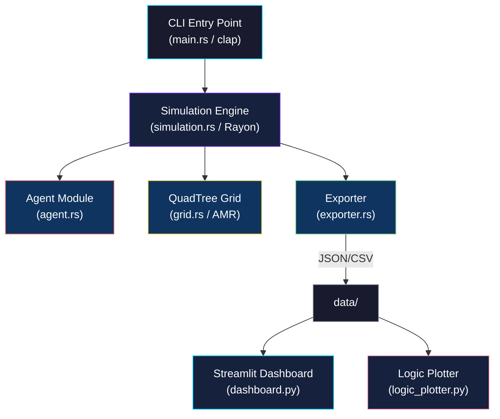
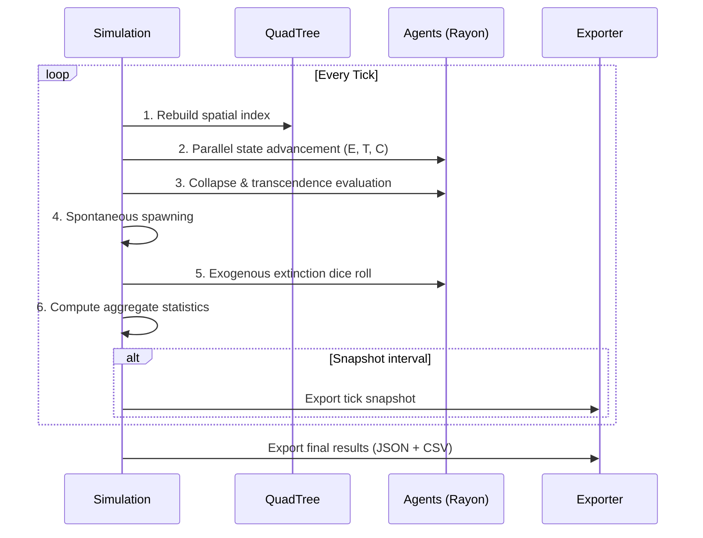

<div align="center">

# CAT Simulation Engine

### Cosmobiological Asynchrony Theory — Agent-Based Fermi Paradox Model

[](LICENSE)
[](https://www.rust-lang.org/)
[](https://www.python.org/)

[](https://github.com/LiranOG/CAT-Simulation-Engine/actions/workflows/rust_ci.yml)
[](https://github.com/LiranOG/CAT-Simulation-Engine/actions/workflows/python_ci.yml)

*A high-performance agent-based model that resolves the Fermi Paradox through the mathematics of civilizational self-destruction. Technology scales exponentially. Wisdom scales logarithmically. The exponential always wins.*

</div>

---

## 📖 Theoretical Background

The **Cosmobiological Asynchrony Theory (CAT)** proposes that the Great Silence is not a mystery but a mathematical inevitability. Three mechanisms conspire to keep the universe quiet:

| Mechanism | Description |
|-----------|-------------|
| **Optical Boundary** | Spacetime delay prevents observation of advanced civilizations in real-time. We see the past, not the present. |
| **Asynchronous Gap** | Technology (E = e^x) outpaces psychological maturity (M = ln(x)). When E crosses a critical threshold while tribalism remains high, civilizations self-destruct. |
| **Hive-Mind Anomaly** | High-collectivism civilizations bypass the filter — no internal conflict means no self-destruction. But they lack the competitive drive for exponential growth. They survive silently. |

### Core Equations

```
E(t) = E₀ · e^(r·t)           — Exponential technological capacity
T(t) = T₀ · (1 - α·ln(1+t))  — Logarithmic tribalism decay
C(t) = clamp(C + δ, 0, 1)     — Linear collectivism drift

COLLAPSE: E > E_crit  ∧  T > T_surv  ∧  C < C_hive  →  Agent.destroy()
```

## 🏗️ Architecture



### Simulation Tick Loop (6 Phases)



## 📁 Repository Structure

```
CAT-Simulation-Engine/
├── .github/                    # CI/CD and contribution templates
│   ├── workflows/
│   │   ├── rust_ci.yml         # Rustfmt, Clippy, tests, cargo-audit
│   │   └── python_ci.yml       # Black, isort, Flake8, pytest
│   ├── ISSUE_TEMPLATE/
│   │   ├── bug_report.md
│   │   └── feature_request.md
│   └── PULL_REQUEST_TEMPLATE.md
├── docs/
│   ├── CAT_Architecture.md     # Mathematical & systems specification
│   └── API_Reference.md        # CLI, library, and analytics API docs
├── engine_rust/                # High-performance simulation core
│   ├── Cargo.toml
│   └── src/
│       ├── main.rs             # CLI entry point (clap)
│       ├── simulation.rs       # 6-phase tick loop (Rayon parallel)
│       ├── agent.rs            # Agent state vectors & collapse dynamics
│       ├── grid.rs             # QuadTree spatial management (AMR)
│       └── exporter.rs         # JSON/CSV data export
├── analytics_python/           # Visualization & analysis
│   ├── requirements.txt
│   ├── dashboard.py            # Dark-mode Streamlit dashboard
│   └── logic_plotter.py        # Publication-quality matplotlib figures
├── data/                       # Simulation output (gitignored contents)
│   └── .gitkeep
├── .gitignore
├── CODE_OF_CONDUCT.md
├── CONTRIBUTING.md
├── LICENSE                     # Apache License 2.0
├── README.md
└── SECURITY.md
```

## 🚀 Quick Start

### Prerequisites

- **Rust** ≥ 1.78 ([install](https://rustup.rs/))
- **Python** ≥ 3.12 ([install](https://www.python.org/downloads/))

### Build & Run the Simulation

```bash
# Clone
git clone https://github.com/cat-research/CAT-Simulation-Engine.git
cd CAT-Simulation-Engine

# Build the Rust engine (release mode for performance)
cd engine_rust
cargo build --release

# Run with default parameters (1000 agents, 10000 ticks)
cargo run --release

# Run with custom parameters
cargo run --release -- \
  -t 50000 \
  -n 5000 \
  --critical-energy 3.0 \
  --survival-tribalism 0.7 \
  --hive-collectivism 0.9 \
  --seed 12345 \
  -o ../data/experiment_01

# Run from a config file
cargo run --release -- -c ../configs/large_run.json
```

### Run Tests

```bash
cd engine_rust
cargo test --all-targets
```

### Launch the Dashboard

```bash
cd analytics_python
pip install -r requirements.txt
python -m streamlit run dashboard.py
```

### Generate Static Figures

```bash
cd analytics_python
python logic_plotter.py --data-dir ../data --output-dir ../data/figures
```

## ⚙️ Configuration

All parameters can be set via CLI flags or a JSON config file:

| Parameter | CLI Flag | Default | Description |
|-----------|----------|---------|-------------|
| Ticks | `-t` | 10,000 | Simulation duration |
| Agents | `-n` | 1,000 | Initial civilizations |
| Spawn Rate | `-s` | 0.5 | Per-tick emergence probability |
| Seed | `--seed` | 42 | RNG seed |
| E_critical | `--critical-energy` | 2.5 | Collapse energy threshold |
| T_survival | `--survival-tribalism` | 0.6 | Collapse tribalism threshold |
| C_hive | `--hive-collectivism` | 0.85 | Transcendence collectivism threshold |
| Grid Size | `--grid-width/height` | 1000 | Simulation space dimensions |
| Threads | `--threads` | 0 (auto) | Rayon thread count |

## 📊 Output Data

The engine produces JSON and CSV files in the output directory:

- `simulation_config.json` — Full run parameters
- `collapse_log.json` / `.csv` — Every civilizational death
- `tick_history.json` / `.csv` — Per-tick aggregate statistics
- `final_agents.csv` — Final state of all agents
- `snapshot_tick_XXXXXX.json` — Periodic full-state snapshots

## 📈 Performance

| Scale | Agents | Ticks | Est. Runtime | RAM |
|-------|--------|-------|-------------|-----|
| Dev | 100 | 1,000 | <1s | <100 MB |
| Small | 1,000 | 10,000 | ~5s | ~1 GB |
| Medium | 100,000 | 50,000 | ~15 min | ~8 GB |
| Large | 1,000,000 | 100,000 | ~4 hrs | ~32 GB |

## 📚 Documentation

- [Architecture & Math Specification](docs/CAT_Architecture.md)
- [API Reference](docs/API_Reference.md)
- [Contributing Guide](CONTRIBUTING.md)
- [Security Policy](SECURITY.md)

## 🤝 Contributing

We welcome contributions. Please read [CONTRIBUTING.md](CONTRIBUTING.md) for guidelines on code style, commit conventions, and PR requirements.

## 📄 License

This project is licensed under the Apache License 2.0 — see [LICENSE](LICENSE) for details.

## 🔒 Security

For vulnerability reporting, see [SECURITY.md](SECURITY.md).

---

<div align="center">

*"The universe is under no obligation to make sense to you."*
— Neil deGrasse Tyson

*But it is under a mathematical obligation to be silent.*
— CAT

</div>
