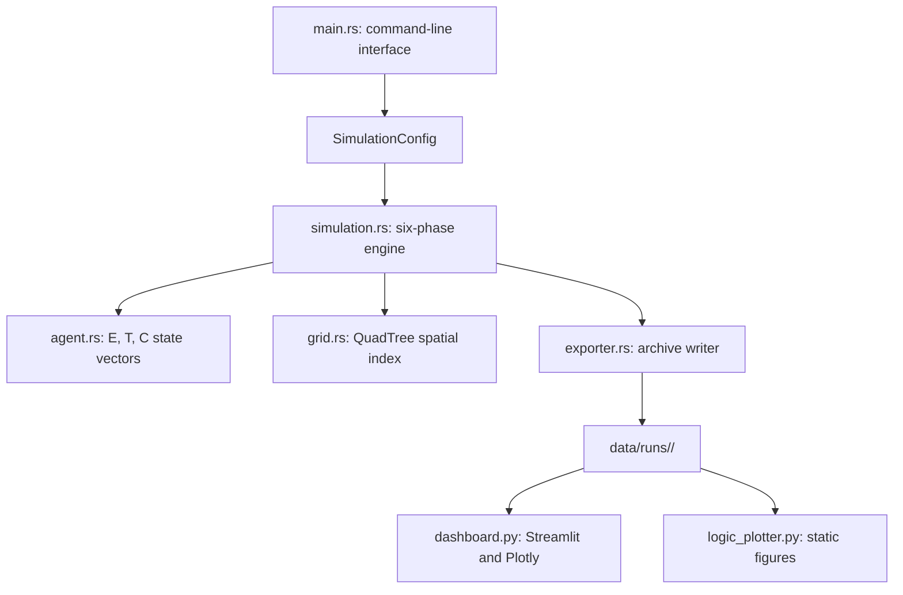
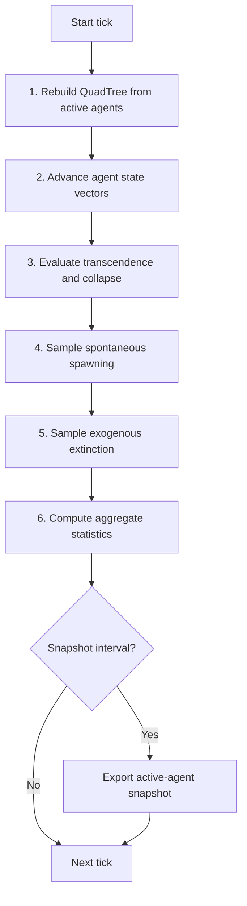

# CAT Architecture: Mathematical and Systems Specification

## 1. Theoretical Foundation

Cosmobiological Asynchrony Theory (CAT) models the Great Silence as an outcome
of three bounds rather than a single missing variable. The theory is presented
as a computational hypothesis, not as an established physical law.

### 1.1 Bound I: Chrono-Optical Horizon

Light-speed delay makes astronomical observation historical. A planet observed
one thousand light-years away is observed as it was one thousand years ago. A
large structure may exist now without being visible in the data currently
arriving at Earth. This bound affects interpretation but is not simulated as a
dynamic variable in the current engine.

### 1.2 Bound II: Asynchronous Gap

The Asynchronous Gap is the modeled rate mismatch between technological capacity
and biological or institutional coordination:

```text
E(t) = min(E0 * exp(r * t), ENERGY_ABS_MAX)
T(t) = T0 * max(0, 1 - alpha * ln(1 + t))
C(t) = clamp(C0 + delta * t, 0, 1)
```

Where:

- `E` is technological or energy capacity.
- `T` is residual tribalism and conflict-prone psychology.
- `C` is collective coordination.
- `t` is ticks since agent ignition.

The engine evaluates these equations from initial conditions at every tick.
It does not numerically integrate them with Euler, Runge-Kutta, or another
stepwise solver. This avoids cumulative integration drift and makes long-run
tests analytically auditable.

### 1.3 Bound III: Hive-Mind Anomaly

Highly collective civilizations can avoid internal collapse because the conflict
channel is suppressed. They may also produce weaker expansion signatures because
they lack the same competitive pressure for rapid technological escalation. In
the current engine, this is represented by the transcendence predicate:

```text
C >= C_hive AND E > 0.5 * E_critical AND T < 0.5 * T_survival
```

Transcended agents are inactive survivors. They no longer participate in the
tick loop, but they remain in final output for analysis.

## 2. Collapse Model

An active agent collapses through the Asynchronous Gap when all three conditions
are true:

```text
E > E_critical
T > T_survival
C < C_hive
```

The current engine also models two additional failure modes:

| Failure Mode | Predicate | Interpretation |
| --- | --- | --- |
| Asynchronous Gap | `E > E_critical AND T > T_survival AND C < C_hive` | Weaponizable capacity outruns coordination. |
| Resource Depletion | `E >= 0.99 * resource_ceiling AND T > T_survival` | High-conflict agents exhaust local capacity before expansion. |
| Exogenous Extinction | Random draw below `exogenous_extinction_rate` | External catastrophe independent of internal state. |

Default threshold values:

```text
E_critical = 2.5
T_survival = 0.6
C_hive = 0.85
exogenous_extinction_rate = 0.000001
resource_ceiling = 5.0
```

## 3. System Components



### 3.1 Rust Engine

- `main.rs` parses CLI arguments, loads optional JSON configuration, resolves
  the data directory, creates a timestamped run archive, and starts the engine.
- `simulation.rs` owns the tick loop, deterministic random number generator,
  agent vector, collapse log, tick history, and spatial index.
- `agent.rs` defines the agent state vectors, collapse predicates,
  transcendence predicate, numerical guards, and derived metrics.
- `grid.rs` implements an adaptive QuadTree for active-agent spatial indexing.
- `exporter.rs` writes JSON and CSV output files and final run manifests.

### 3.2 Python Analytics

- `dashboard.py` provides a Streamlit dashboard using Plotly figures.
- `logic_plotter.py` generates static publication-oriented figures from one
  completed run directory.

## 4. Six-Phase Tick Loop



Phase 2 uses Rayon parallel iteration when the agent count is at least
`PARALLEL_MIN_AGENTS`. The random number generator is used only in the main
thread for spawning and exogenous extinction, preserving deterministic behavior
for a fixed seed and configuration.

## 5. QuadTree Spatial Management

The QuadTree indexes only active agents. Each node is either:

- A leaf containing a vector of `AgentRef` values.
- An internal node containing four child quadrants and a cached agent count.

Subdivision occurs when a leaf exceeds `max_agents_per_node`, unless the node
has already reached `max_depth`. Empty buckets become empty leaves immediately.
This avoids recursive allocation in unoccupied regions of the simulation space.

Query behavior:

- `query_range` returns agents inside an axis-aligned bounding box.
- `query_radius` first applies an axis-aligned prefilter and then checks exact
  squared Euclidean distance.
- `depth_stats` reports minimum leaf depth, maximum leaf depth, and total leaf
  count for diagnostics.

## 6. Data Pipeline

Each completed run is written under:

```text
data/runs/YYYY-MM-DD_HHMMSS_seed<seed>_n<agents>/
```

Final files:

| File | Format | Purpose |
| --- | --- | --- |
| `simulation_config.json` | JSON | Full run configuration, including resolved paths. |
| `tick_history.json` | JSON | Per-tick aggregate statistics. |
| `tick_history.csv` | CSV | Tabular form of tick history. |
| `collapse_log.json` | JSON | Collapse events with identifiers and state vectors. |
| `collapse_log.csv` | CSV | Tabular form of collapse events. |
| `final_agents.csv` | CSV | Final state of every agent. |
| `snapshot_tick_XXXXXX.json` | JSON | Periodic active-agent snapshots. |
| `RUN_MANIFEST.json` | JSON | Completion signal and file inventory. |

Final JSON and CSV outputs use a write-then-rename pattern where practical.
`RUN_MANIFEST.json` is written last. The dashboard treats directories without a
manifest as incomplete and does not load them as valid runs.

## 7. Complexity and Performance

| Operation | Complexity | Notes |
| --- | --- | --- |
| Agent state update | `O(N / P)` | Parallel when `N >= 128`; `P` is worker count. |
| Collapse evaluation | `O(N)` | Sequential mutation phase. |
| QuadTree rebuild | `O(N log N)` typical | Bounded by configured max depth. |
| Range query | `O(log N + K)` typical | `K` is returned candidate count. |
| Final export | `O(N + C + T)` | Agents, collapse events, and tick records. |

The model is intended for reproducible experiments. For large ensembles, prefer
multiple independent run archives with explicit seeds rather than overwriting a
single output directory.
